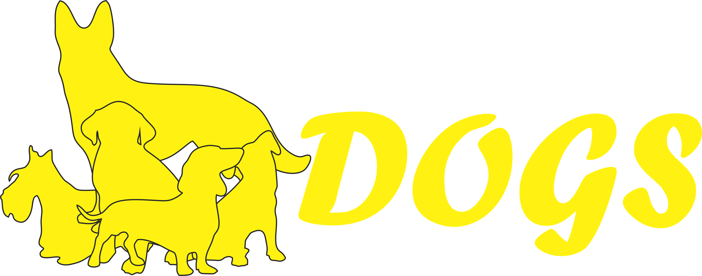
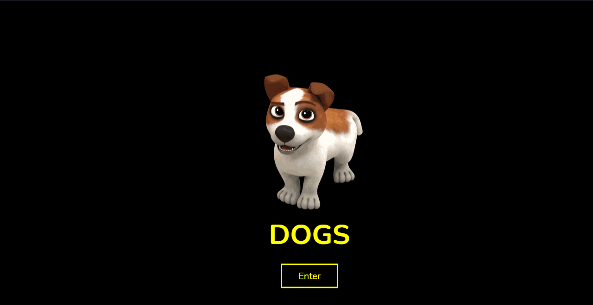
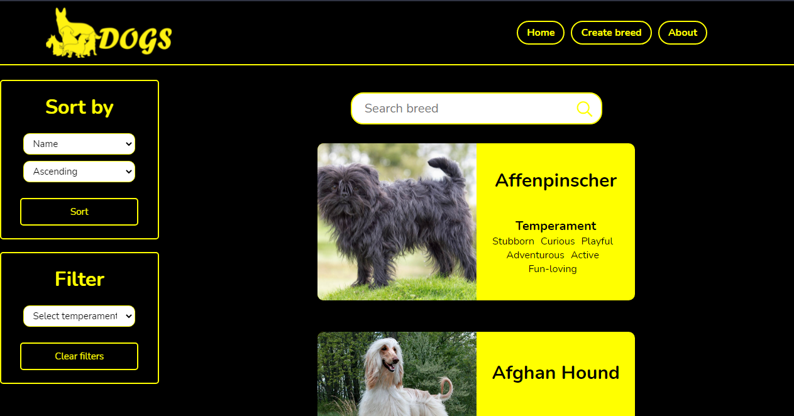
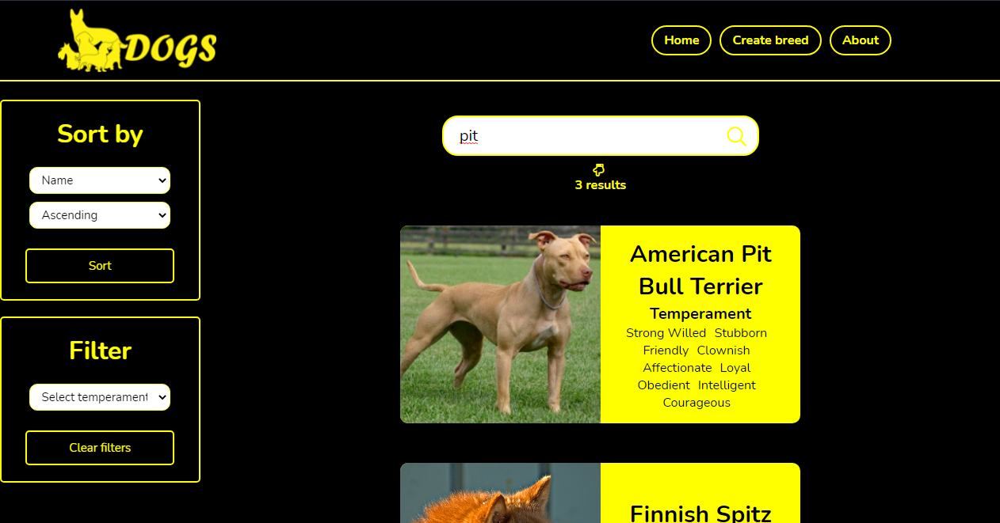
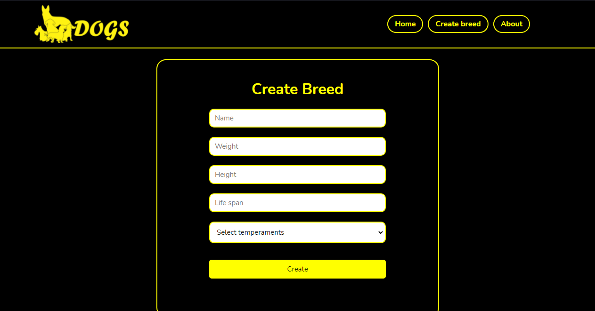
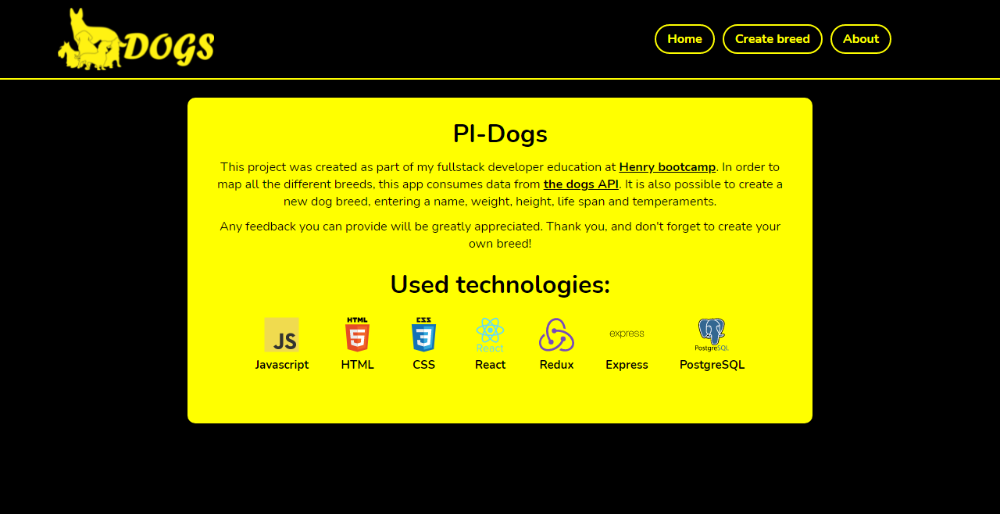

# Proyecto Individual - Henry Dogs

  

## Objetivos del Proyecto
- Construir una App utlizando React, Redux, Node y Sequelize.
- Afirmar y conectar los conceptos aprendidos en la carrera.
- Aprender mejores prácticas.
- Aprender y practicar el workflow de GIT.
- Usar y practicar testing.
- El proyecto tendrá una duración máxima de tres semanas.

#### Tecnologías utilizadas:
- React
- Redux
- Express
- Sequelize - Postgres

## Como instalar el Proyecto:
- Primero deberas crearte una cuenta en <a> https://thedogapi.com/ </a>, donde te otorgarán una API KEY para usarlo mas adelante.
- Segundo deberas hacer npm install para instalar todas las dependencias, luego deberas crear un archivo `.env` en la carpeta api que contenga la siguiente información:
- `DB_HOST`=localhost
- `DB_USER`=usuario de su base de datos
- `DB_PASSWORD`=contraseña de su base de datos
- `API_KEY`=clave de la API
- `PORT`=número del puerto que se utilizará

## Para observar el Proyecto
- 🌐 Link: https://dogsapp.vercel.app/

## Imagenes del proyecto
 
<h2 align="left">
🟨Landing Page
</h2>

  

 
<h2 align="left">
🟨Home
</h2>

  

 
<h2 align="left">
🟨Búsqueda en tiempo real
</h2>

  

 
<h2 align="left">
🟨Crear una raza de perro
</h2>

  

 
<h2 align="left">
🟨Detalles de los perros
</h2>

  

 
<h2 align="left">
🟨Acerca del proyecto
</h2>

  

 
 
<h1>Muchas gracias por ver el proyecto 😁👋</h1>